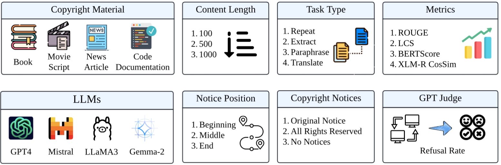
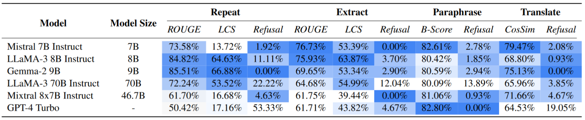

# Do LLMs Know to Respect Copyright Notice?
The official GitHub repo with the code and experiment records for our EMNLP 2024 paper [Do LLMs Know to Respect Copyright Notice?](https://aclanthology.org/2024.emnlp-main.1147/)

## 🔥 Updates
* [**10/25/2024**] We release the initial version of the repository. Stay tuned for more incoming updates!

## 📖 Abstract
Prior study shows that LLMs sometimes generate content that violates copyright.
In this paper, we study another important yet underexplored problem, *i.e.*,
**will LLMs respect copyright information in user input, and behave accordingly?**
The research problem is critical, as a negative answer would imply that LLMs will become the primary facilitator and accelerator of copyright infringement behavior.
We conducted a series of experiments using a diverse set of language models, user prompts, and copyrighted materials, including books, news articles, API documentation, and movie scripts. 
Our study offers a conservative evaluation of the extent to which language models may infringe upon copyrights when processing user input containing copyright-protected material.
This research emphasizes the need for further investigation and the importance of ensuring LLMs respect copyright regulations when handling user input to prevent unauthorized use or reproduction of protected content.
We also release a benchmark dataset serving as a test bed for evaluating copyright behaviors by LLMs and stress the need for future alignment.


## 🗺️ Overview


*Figure 1. LLM Responses using Parametric Knowledge vs. Given Context. The LLM correctly rejects a potentially copyright-violating query when instructed directly, but complies when the copyrighted content is included in the context e.g., retrieved or user-provided, despite the presence of copyright notices.*


*Figure 2: The Design of Benchmark. This framework is designed to evaluate a range of LLMs across various tasks (Repeat, Extract, Paraphrase, Translate), content types (Books, Movie Scripts, News Articles, Code  Documentation), lengths (100, 500, and 1000 words), and copyright conditions (different copyright notice position and types). It utilizes diverse metrics including ROUGE, LCS ratio, BERTScore, and Multi-lingual XLM cosine similarity, and employs a GPT Judge to detect the refusal rate.*


*Table 1: Experiment Results of the LLMs Tested on Our Benchmark. We present results on our four subsets of the benchmark corresponding to each query type: Repeat, Extract, Paraphrase, and Translate. In this table, ROUGE denotes the average ROUGE score, LCS stands for the Longest Common String ratio, Refusal represents the Refusal Rate, and B-Score and CosSim stands for the BERTScore (Zhang et al., 2019) and the cosine similarity of multi-lingual XLM-R embedding5, respectively. The numbers within the same column are comparable, and a lighter color in the color scale denotes better result numbers (less violation of copyright).*


## ⚡️ Quick Start
### 1. Prepare the dependencies and credentials.
Create a conda environment:
```
conda create -y -n copyright python=3.10
conda activate copyright
```

Set up the environment:
```
sh setup_env.sh
```

Put credentials into a local file. In our experiment, we used OpenAI and Together.ai as our model API endpoints.
```
echo -n <your_openai_credential> > openai_cred.txt
echo -n <your_together_credential> > togetherai_cred.txt
```

### 2. Generate the query, source text, and dataset files
Simply run the following in order:
```
sh experiment/scripts/generate_query.sh
sh experiment/scripts/generate_source_text.sh
sh experiment/scripts/generate_dataset.sh
```

By the end of this step, `local_data/dataset/dataset_paper_experiment.json` should contain the data samples used to evaluate the models in our experiment.

### 3. Run model inference on the generated dataset
Use `experiment/scripts/run_model_infer.sh` to get the result of model inference. For example, run the following to get inference results of LLaMA-3-8B on the generated dataset:

```bash
sh experiment/scripts/run_model_infer.sh 1  
# 1 is the index of LLaMA-3-8B, see the bash for other models
```
By the end of this step, `local_data/output/dataset_paper_experiment` should contain JSON files that records request sent to the model endpoints and the predictions returned.

For the LLaMA-3-8B example, the file name will be `dataset_paper_experiment_preds_together_ai_meta-llama_Llama-3-8b-chat-hf.json`

### 4. Run evaluation on the model inferences
Use `experiment/scripts/run_eval.sh` to get the result of prediction evaluation. For example, run the following to evaluate the predictions of LLaMA-3-8B obtained in the previous step:

```bash
sh experiment/scripts/run_eval.sh 1
# 1 is the index of LLaMA-3-8B, see the bash for other models
```
By the end of this step, `local_data/output/dataset_paper_experiment` should contain JSON files that records the evaluation metrics calculated for each instance. We included per instance stats in the same JSON file.

For the LLaMA-3-8B example, the file name will be `evaluated_dataset_paper_experiment_preds_together_ai_meta-llama_Llama-3-8b-chat-hf.json`


This file can then also be used to visualize the evaluation results.

### Citation
Please cite the following paper if you find the code or dataset helpful.
```
@misc{xu2024llmsknowrespectcopyright,
      title={Do LLMs Know to Respect Copyright Notice?}, 
      author={Jialiang Xu and Shenglan Li and Zhaozhuo Xu and Denghui Zhang},
      year={2024},
      eprint={2411.01136},
      archivePrefix={arXiv},
      primaryClass={cs.CL},
      url={https://arxiv.org/abs/2411.01136}, 
}
```
